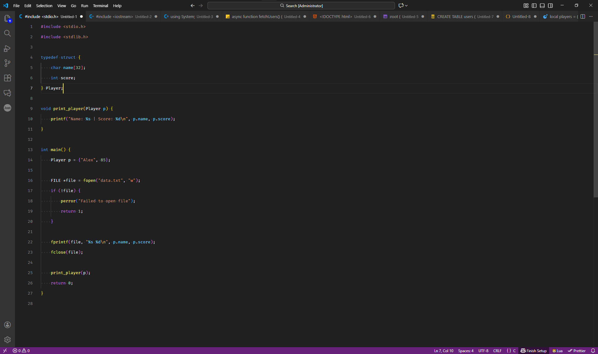
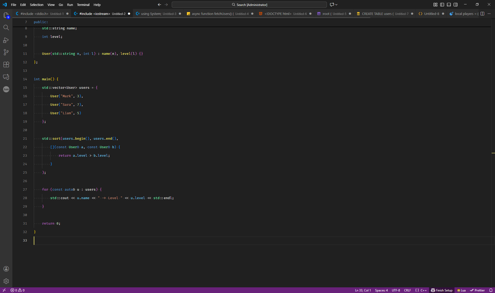
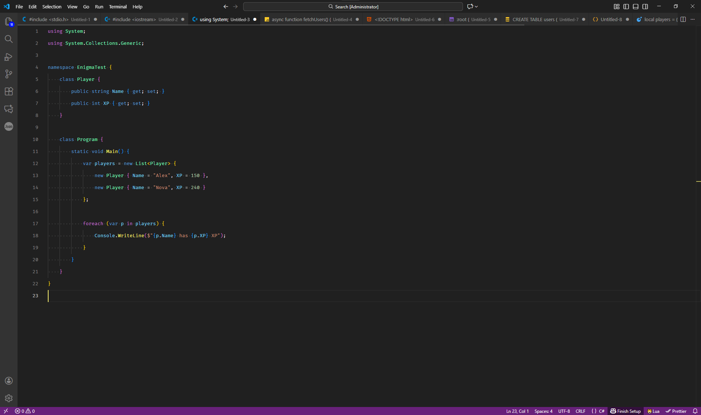
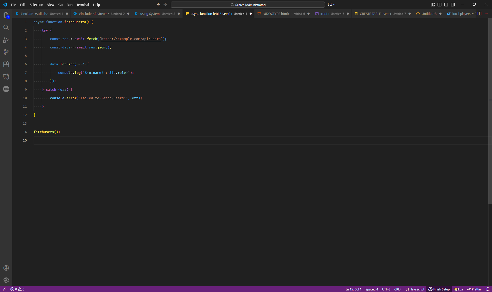
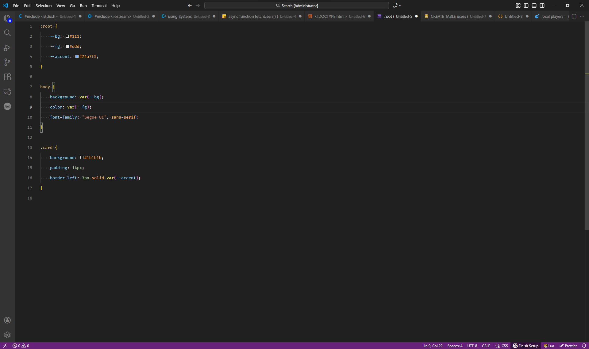
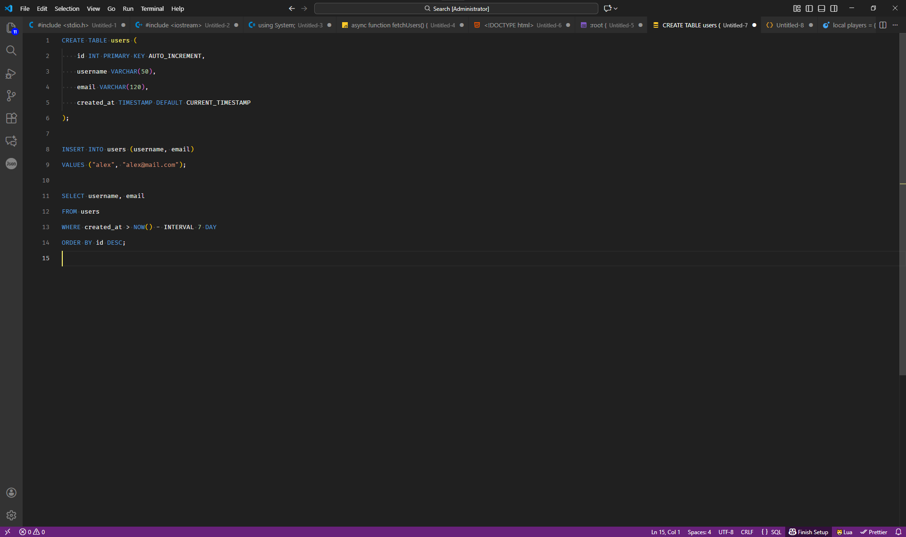
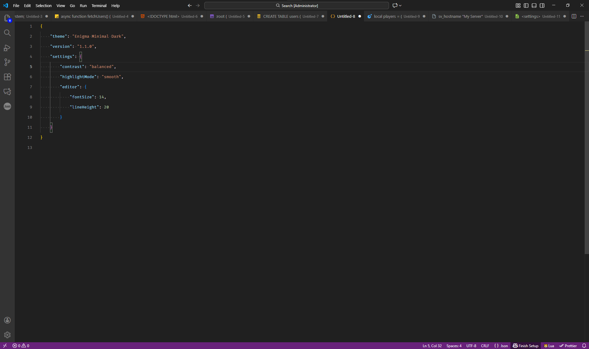
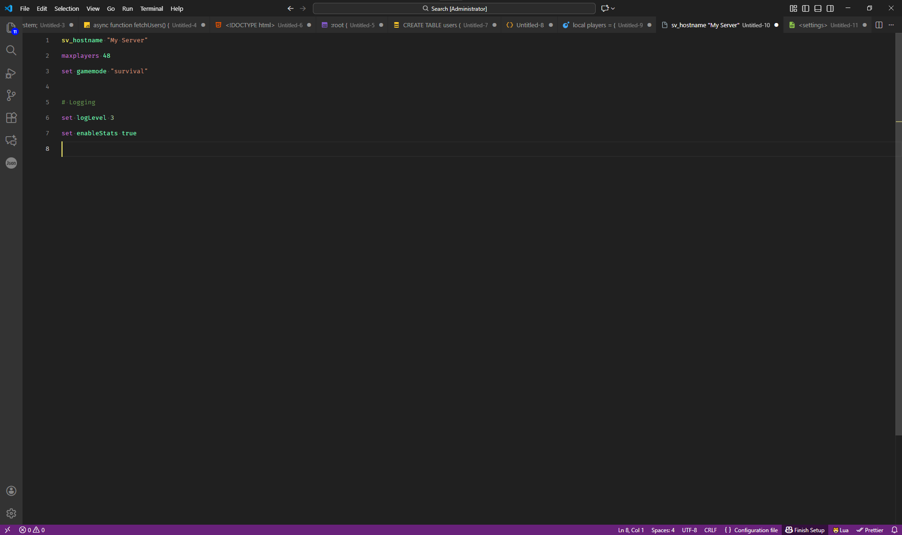
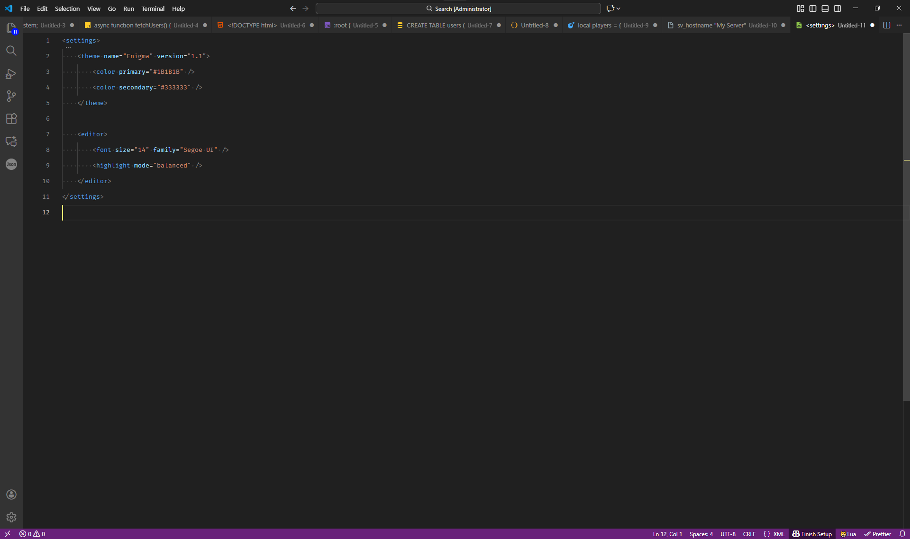

# Enigma Minimal Dark Theme
## Why Enigma?
Enigma is designed to avoid overly saturated colors, harsh contrasts, and visual clutter.  
The goal is to provide a calm and focused environment suitable for long coding sessions.

## Preview
Screenshots showing the theme in action:

## Supported Languages
Enigma provides consistent syntax highlighting for a wide range of languages, including:
C, C++, C#, JavaScript, HTML, CSS, SQL, JSON, Lua, CFG, XML, and many others.

## Features
* Minimal and elegant dark color palette
* Smooth and readable syntax highlighting
* Optimized contrast for long coding sessions
* Consistent UI elements and editor colors
* Designed for clarity without unnecessary visual noise

## Support the Project

## Installation
* Open the Extensions view in VS Code
* Search for Enigma Minimal Dark Theme
* Install the theme
* Activate it and Enjoy Coding

## For more information and Feedback
If you encounter any issues or want to suggest improvements, feel free to open an issue or submit a pull request in the repository.

* [Repository](https://github.com/HstufAmir/enigma-theme)
* [Marketplace](https://marketplace.visualstudio.com/items?itemName=HstufAmir.enigma-minimal-dark-theme)
* [Discord](https://discord.gg/p3Wfp6KGbj)

## License
This theme is released under the MIT License.

**Enjoy!**